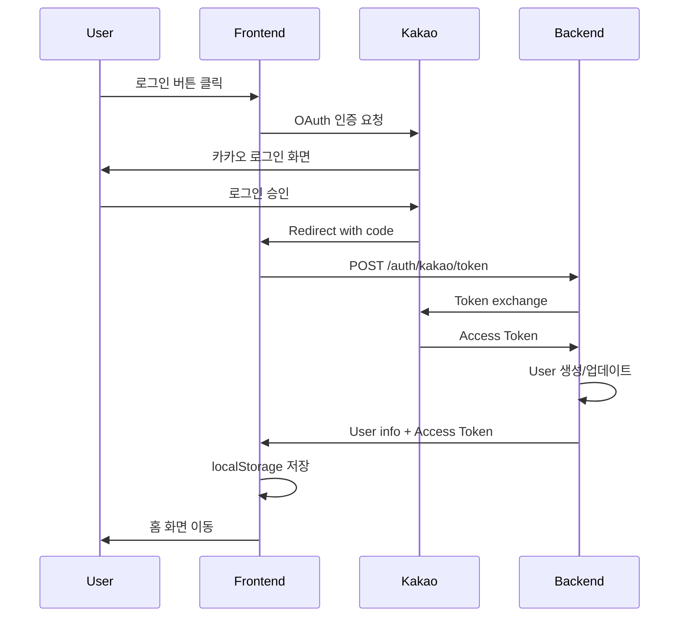

# 🎫 한국어 복권 티켓 애플리케이션 - 인수인계 문서

**작성일:** 2026년 3월 4일  
**프로젝트명:** Korean Lottery Ticket Application  
**디자인 기준:** Figma 모바일 화면 (480px 고정 너비)

---

## 📋 목차

1. [프로젝트 개요](#프로젝트-개요)
2. [기술 스택](#기술-스택)
3. [프로젝트 구조](#프로젝트-구조)
4. [주요 기능](#주요-기능)
5. [백엔드 API](#백엔드-api)
6. [데이터베이스 스키마](#데이터베이스-스키마)
7. [인증 시스템](#인증-시스템)
8. [결제 시스템](#결제-시스템)
9. [최근 해결한 이슈](#최근-해결한-이슈)
10. [현재 진행 중인 작업](#현재-진행-중인-작업)
11. [다음 단계](#다음-단계)
12. [중요 주의사항](#중요-주의사항)

---

## 🎯 프로젝트 개요

한국어 복권 티켓 애플리케이션은 사용자가 포인트를 충전하여 7가지 카테고리의 럭키드로우 티켓을 구매하고, 당첨 결과를 확인할 수 있는 모바일 웹 애플리케이션입니다.

### 핵심 컨셉
- **포인트 충전 → 티켓 구매 → 당첨 확인**
- 7가지 티켓 카테고리 (Diamond, Gold, Silver, Bronze, Star, Platinum, Rainbow)
- 카카오 로그인 연동
- 토스페이먼츠 결제 시스템
- 관리자 페이지 (상품/회원/럭키드로우/통계 관리)

### 디자인 원칙
- **절대 변경 금지:** Figma에서 디자인된 스타일 유지
- **모바일 우선:** 480px 고정 너비
- **브랜드 컬러:** 검정색 기반 UI

---

## 🛠 기술 스택

### Frontend
- **React 18** (TypeScript)
- **React Router** (Data Mode)
- **Tailwind CSS v4**
- **Motion** (Framer Motion) - 애니메이션
- **Lucide React** - 아이콘

### Backend
- **Supabase Edge Functions** (Deno runtime)
- **Hono** - 웹 서버 프레임워크
- **Supabase Auth** - 회원 관리
- **Supabase KV Store** - 데이터 저장

### External APIs
- **Kakao OAuth 2.0** - 소셜 로그인
- **Toss Payments** - 결제 처리

### Environment Variables (Supabase Secrets)
```
SUPABASE_URL
SUPABASE_ANON_KEY
SUPABASE_SERVICE_ROLE_KEY
SUPABASE_DB_URL
TOSS_SECRET_KEY
```

---

## 📁 프로젝트 구조

```
/
├── src/
│   ├── app/
│   │   ├── App.tsx                          # 메인 엔트리포인트 (RouterProvider)
│   │   ├── routes.ts                        # React Router 설정
│   │   ├── components/
│   │   │   ├── Header.tsx                   # 상단 헤더
│   │   │   ├── BottomNav.tsx                # 하단 네비게이션 바
│   │   │   ├── TicketCard.tsx               # 티켓 카드 컴포넌트
│   │   │   └── figma/
│   │   │       └── ImageWithFallback.tsx    # 🔒 보호된 파일
│   │   ├── pages/
│   │   │   ├── Home.tsx                     # 홈 화면 (티켓 카테고리 목록)
│   │   │   ├── Points.tsx                   # 포인트 충전 페이지
│   │   │   ├── Tickets.tsx                  # 보유 티켓 목록
│   │   │   ├── MyPage.tsx                   # 마이페이지
│   │   │   ├── Login.tsx                    # 로그인 페이지
│   │   │   ├── LoginCallback.tsx            # 카카오 로그인 콜백 (중복 방지 로직)
│   │   │   ├── TicketCategory.tsx           # 동적 티켓 카테고리 페이지
│   │   │   ├── Admin.tsx                    # 관리자 페이지 (탭 기반)
│   │   │   └── PaymentSuccess.tsx           # 결제 성공 페이지
│   │   └── context/
│   │       └── AppContext.tsx               # 글로벌 상태 관리 (로그인, 포인트)
│   ├── styles/
│   │   ├── theme.css                        # Tailwind 테마 및 토큰
│   │   └── fonts.css                        # 폰트 import
│   └── imports/                             # Figma import 에셋
│
├── supabase/
│   └── functions/
│       └── server/
│           ├── index.tsx                    # Hono 서버 (모든 API 엔드포인트)
│           └── kv_store.tsx                 # 🔒 보호된 파일 (KV 유틸리티)
│
├── utils/
│   └── supabase/
│       └── info.tsx                         # 🔒 보호된 파일 (projectId, publicAnonKey)
│
└── package.json
```

### 🔒 보호된 파일 (절대 수정 금지)
- `/src/app/components/figma/ImageWithFallback.tsx`
- `/supabase/functions/server/kv_store.tsx`
- `/utils/supabase/info.tsx`
- `/pnpm-lock.yaml`

---

## 🎨 주요 기능

### 1. 홈 화면 (`/`)
- 7가지 티켓 카테고리 표시
- 각 카테고리별 상품 목록 동적 로딩
- 티켓 가격, 재고 상태 실시간 표시
- 하단 네비게이션 바 (홈, 포인트, 티켓, 마이페이지)

### 2. 티켓 카테고리 페이지 (`/category/:categoryId`)
- 동적 라우팅으로 구현
- 백엔드 API에서 상품 데이터 로딩
- 티켓 구매 기능
- 포인트 부족 시 포인트 충전 페이지로 이동

### 3. 포인트 충전 (`/points`)
- 토스페이먼츠 연동
- 충전 금액 선택 (10,000원 ~ 500,000원)
- 결제 성공 후 포인트 자동 증가
- 새로고침 버튼으로 포인트 재조회

### 4. 보유 티켓 (`/tickets`)
- 사용자가 구매한 티켓 목록
- 당첨 결과 확인
- 티켓 상태 (사용 전, 당첨, 낙첨)

### 5. 마이페이지 (`/mypage`)
- 사용자 정보 표시 (카카오 프로필)
- 현재 포인트 표시
- 로그아웃 기능

### 6. 관리자 페이지 (`/admin`)
**4개 탭으로 구성:**

#### 탭 1: 상품 관리
- 카테고리별 상품 목록 조회
- 상품 생성, 수정, 삭제
- 재고 수량, 가격 관리
- 당첨 확률 설정

#### 탭 2: 회원 관리
- 전체 회원 목록 조회
- 회원명, 이메일 표시
- 회원 삭제 기능
- 가입일 정보

#### 탭 3: 럭키드로우 관리
- 전체 구매 이력 조회
- 동적 데이터 로딩 (하드코딩 제거 완료)
- 구매자, 상품명, 당첨 결과 표시
- 구매일 정보

#### 탭 4: 통계
- 총 회원 수
- 총 판매 금액
- 카테고리별 판매 통계
- 실시간 업데이트

---

## 🔌 백엔드 API

**Base URL:** `https://{projectId}.supabase.co/functions/v1/make-server-53dba95c`

### 인증 (Auth)

#### `POST /auth/kakao/token`
카카오 OAuth 인증 코드를 액세스 토큰으로 교환

**Request:**
```json
{
  "code": "authorization_code",
  "redirectUri": "http://localhost/login/callback"
}
```

**Response:**
```json
{
  "success": true,
  "user": {
    "kakaoId": "4779252386",
    "nickname": "이대현",
    "email": "leedaehyun123@kakao.com",
    "profileImage": "https://..."
  },
  "accessToken": "kakao_access_token"
}
```

#### `GET /auth/me`
현재 로그인한 사용자 정보 조회

**Headers:**
```
Authorization: Bearer {kakao_access_token}
```

**Response:**
```json
{
  "success": true,
  "user": {
    "kakaoId": "4779252386",
    "nickname": "이대현",
    "profileImage": "https://...",
    "email": "leedaehyun123@kakao.com"
  }
}
```

---

### 사용자 (User)

#### `GET /user/{kakaoId}/data`
사용자의 포인트 및 기본 정보 조회

**Headers:**
```
Authorization: Bearer {kakao_access_token}
```

**Response:**
```json
{
  "success": true,
  "user": {
    "kakaoId": "4779252386",
    "nickname": "이대현",
    "email": "leedaehyun123@kakao.com",
    "points": 500000,
    "createdAt": "2026-03-04T10:00:00Z"
  }
}
```

#### `POST /user/{kakaoId}/points`
사용자 포인트 충전

**Request:**
```json
{
  "amount": 50000,
  "orderId": "order_abc123",
  "paymentKey": "payment_key_xyz"
}
```

**Response:**
```json
{
  "success": true,
  "newPoints": 550000
}
```

---

### 상품 (Products)

#### `GET /products/{category}`
특정 카테고리의 상품 목록 조회

**Categories:** `diamond`, `gold`, `silver`, `bronze`, `star`, `platinum`, `rainbow`

**Response:**
```json
{
  "success": true,
  "products": [
    {
      "id": "product_diamond_001",
      "name": "다이아몬드 티켓 1등급",
      "category": "diamond",
      "price": 50000,
      "probability": 0.001,
      "stock": 100,
      "isActive": true,
      "imageUrl": "https://...",
      "description": "최고급 다이아몬드 티켓"
    }
  ]
}
```

#### `POST /purchase`
티켓 구매

**Request:**
```json
{
  "kakaoId": "4779252386",
  "productId": "product_diamond_001"
}
```

**Response:**
```json
{
  "success": true,
  "ticket": {
    "id": "ticket_abc123",
    "productId": "product_diamond_001",
    "productName": "다이아몬드 티켓 1등급",
    "category": "diamond",
    "isWinner": false,
    "purchasedAt": "2026-03-04T11:00:00Z"
  },
  "newPoints": 450000
}
```

#### `GET /tickets/{kakaoId}`
사용자 보유 티켓 목록 조회

**Response:**
```json
{
  "success": true,
  "tickets": [
    {
      "id": "ticket_abc123",
      "productName": "다이아몬드 티켓 1등급",
      "category": "diamond",
      "isWinner": false,
      "purchasedAt": "2026-03-04T11:00:00Z"
    }
  ]
}
```

---

### 관리자 (Admin)

#### `GET /admin/products/{category}`
관리자용 상품 목록 조회

**Response:**
```json
{
  "success": true,
  "products": [...]
}
```

#### `POST /admin/products`
새 상품 생성

**Request:**
```json
{
  "name": "골드 티켓 VIP",
  "category": "gold",
  "price": 30000,
  "probability": 0.05,
  "stock": 200,
  "imageUrl": "https://...",
  "description": "골드 VIP 티켓"
}
```

#### `PUT /admin/products/{productId}`
상품 수정

**Request:**
```json
{
  "name": "골드 티켓 VIP (수정)",
  "price": 35000,
  "stock": 180
}
```

#### `DELETE /admin/products/{productId}`
상품 삭제

**Response:**
```json
{
  "success": true,
  "message": "Product deleted"
}
```

#### `GET /admin/users`
전체 회원 목록 조회

**Response:**
```json
{
  "success": true,
  "users": [
    {
      "kakaoId": "4779252386",
      "nickname": "이대현",
      "email": "leedaehyun123@kakao.com",
      "points": 500000,
      "createdAt": "2026-03-01T10:00:00Z"
    }
  ]
}
```

#### `DELETE /admin/users/{kakaoId}`
회원 삭제

**Response:**
```json
{
  "success": true,
  "message": "User deleted"
}
```

#### `GET /admin/lucky-draws`
전체 럭키드로우 구매 이력 조회

**Response:**
```json
{
  "success": true,
  "draws": [
    {
      "ticketId": "ticket_abc123",
      "kakaoId": "4779252386",
      "userName": "이대현",
      "productName": "다이아몬드 티켓 1등급",
      "category": "diamond",
      "isWinner": false,
      "purchasedAt": "2026-03-04T11:00:00Z"
    }
  ]
}
```

#### `GET /admin/stats`
통계 데이터 조회

**Response:**
```json
{
  "success": true,
  "stats": {
    "totalUsers": 150,
    "totalRevenue": 15000000,
    "categoryStats": {
      "diamond": { "count": 50, "revenue": 2500000 },
      "gold": { "count": 100, "revenue": 3000000 }
    }
  }
}
```

---

### 결제 (Payments)

#### `POST /payments/confirm`
토스페이먼츠 결제 승인

**Request:**
```json
{
  "paymentKey": "payment_key_xyz",
  "orderId": "order_abc123",
  "amount": 50000
}
```

**Response:**
```json
{
  "success": true,
  "payment": {
    "orderId": "order_abc123",
    "amount": 50000,
    "status": "DONE"
  }
}
```

---

## 💾 데이터베이스 스키마

**KV Store 기반 (Key-Value)**

### Users
**Key:** `user:{kakaoId}`

**Value:**
```json
{
  "kakaoId": "4779252386",
  "nickname": "이대현",
  "email": "leedaehyun123@kakao.com",
  "profileImage": "https://...",
  "points": 500000,
  "accessToken": "kakao_token",
  "lastLoginAt": "2026-03-04T10:00:00Z",
  "createdAt": "2026-03-01T10:00:00Z"
}
```

### Products
**Key:** `product:{category}:{productId}`

**Value:**
```json
{
  "id": "product_diamond_001",
  "name": "다이아몬드 티켓 1등급",
  "category": "diamond",
  "price": 50000,
  "probability": 0.001,
  "stock": 100,
  "isActive": true,
  "imageUrl": "https://...",
  "description": "최고급 티켓",
  "createdAt": "2026-03-01T10:00:00Z"
}
```

### Tickets (Lucky Draws)
**Key:** `ticket:{kakaoId}:{ticketId}`

**Value:**
```json
{
  "id": "ticket_abc123",
  "kakaoId": "4779252386",
  "productId": "product_diamond_001",
  "productName": "다이아몬드 티켓 1등급",
  "category": "diamond",
  "isWinner": false,
  "purchasedAt": "2026-03-04T11:00:00Z"
}
```

### Payments
**Key:** `payment:{orderId}`

**Value:**
```json
{
  "orderId": "order_abc123",
  "kakaoId": "4779252386",
  "amount": 50000,
  "paymentKey": "payment_key_xyz",
  "status": "DONE",
  "createdAt": "2026-03-04T10:30:00Z"
}
```

---

## 🔐 인증 시스템

### 카카오 로그인 플로우



### 로그인 상태 관리

**AppContext.tsx**
```typescript
{
  isLoggedIn: boolean,
  kakaoId: string,
  userName: string,
  userEmail: string,
  profileImage: string,
  accessToken: string,
  points: number
}
```

**localStorage 저장 항목:**
- `kakao_access_token`
- `kakao_id`
- `user_name`
- `user_email`
- `profile_image`

### 중복 로그인 방지

**LoginCallback.tsx**
- `useRef` 훅으로 `hasProcessed` 플래그 관리
- useEffect 의존성을 `location.search`만 사용
- 카카오 Authorization Code 재사용 방지

---

## 💳 결제 시스템

### 토스페이먼츠 통합

**충전 플로우:**
```
1. Points.tsx: 충전 금액 선택
2. 토스 결제창 호출
3. 결제 성공 → PaymentSuccess.tsx로 리다이렉트
4. Backend: /payments/confirm 호출
5. Backend: 결제 승인 + 포인트 증가
6. Frontend: 포인트 업데이트 + 홈으로 이동
```

**환경 변수:**
- `TOSS_SECRET_KEY`: `live_sk_QbgMGZz...` (Supabase Secret)

**Client Key (Frontend):**
```typescript
const clientKey = 'live_ck_...'; // Points.tsx에 하드코딩
```

---

## ✅ 최근 해결한 이슈

### 1. 카카오 로그인 중복 호출 (2026-03-04)
**문제:**
- LoginCallback이 2번 실행되어 Authorization Code 재사용 에러 (400)
- 첫 번째 요청은 성공하지만 두 번째 요청에서 "invalid_grant" 에러

**해결:**
- `useRef`로 `hasProcessed` 플래그 추가
- useEffect 의존성을 `location.search`만 사용
- 중복 실행 방지 로직 구현

**수정 파일:** `/src/app/pages/LoginCallback.tsx`

---

### 2. 포인트 새로고침 401 에러 (2026-03-04)
**문제:**
- `/auth/me` API 호출 시 "Invalid JWT" 에러
- 카카오 Access Token을 JWT로 착각

**해결:**
- 백엔드에서 카카오 API (`https://kapi.kakao.com/v2/user/me`) 직접 호출
- 토큰 검증 로직 수정
- 에러 로깅 강화

**수정 파일:** `/supabase/functions/server/index.tsx`

---

### 3. 백엔드 하드코딩 제거 (2026-03-03)
**문제:**
- 서버 시작 시 초기 상품 데이터 자동 생성
- 로그인 시 회원 데이터 자동 생성 (500,000 포인트)

**해결:**
- 초기 상품 생성 로직 완전 제거
- 로그인 시 회원 데이터는 생성하되 포인트는 0으로 설정
- 관리자 페이지에서 수동으로 상품 생성

**수정 파일:** `/supabase/functions/server/index.tsx`

---

### 4. 럭키드로우 페이지 동적 로딩 (2026-03-03)
**문제:**
- 관리자 페이지 럭키드로우 탭에 하드코딩된 더미 데이터

**해결:**
- `/admin/lucky-draws` API에서 실제 티켓 구매 이력 조회
- 사용자명 표시를 위해 user 정보 병합
- 동적 데이터 렌더링

**수정 파일:** `/src/app/pages/Admin.tsx`, `/supabase/functions/server/index.tsx`

---

### 5. 회원 관리 기능 강화 (2026-03-03)
**문제:**
- 관리자 페이지에서 회원명/이메일 표시 안됨
- 회원 삭제 기능 없음

**해결:**
- `DELETE /admin/users/{kakaoId}` API 구현
- 회원명, 이메일, 가입일 표시
- 삭제 확인 다이얼로그 추가

**수정 파일:** `/src/app/pages/Admin.tsx`, `/supabase/functions/server/index.tsx`

---

### 6. 7개 티켓 페이지 동적 로딩 (2026-03-02)
**문제:**
- 각 카테고리별로 별도 페이지 컴포넌트 존재
- 코드 중복

**해결:**
- `/category/:categoryId` 동적 라우팅 구현
- `TicketCategory.tsx` 단일 컴포넌트로 통합
- 백엔드 API에서 카테고리별 상품 로딩

**수정 파일:** `/src/app/pages/TicketCategory.tsx`, `/src/app/routes.ts`

---

## 🚧 현재 진행 중인 작업

### 1. 카카오 로그인 테스트 중
**상태:** 코드 수정 완료, 사용자 테스트 대기중

**확인 필요 사항:**
- [ ] 로그아웃 → 재로그인 정상 작동
- [ ] 첫 로그인 시 포인트 "0P" 표시
- [ ] 포인트 새로고침(🔄) 버튼 정상 작동
- [ ] 브라우저 콘솔에 중복 호출 에러 없음
- [ ] Supabase Functions 로그에 400 에러 없음

**테스트 순서:**
```
1. 마이페이지 → [로그아웃]
2. 카카오 로그인
3. 홈 화면에서 포인트 확인 (0P 예상)
4. /points 페이지 이동 → 새로고침 버튼 클릭
5. 콘솔 및 Supabase 로그 확인
```

---

### 2. 상품 이미지 업로드 기능 (미구현)
**현재 상태:**
- 상품 생성 시 `imageUrl` 필드는 텍스트 입력
- Unsplash 이미지 URL 수동 입력 필요

**개선 방안:**
- Supabase Storage 버킷 생성
- 이미지 파일 업로드 기능 구현
- Signed URL 생성

---

### 3. 당첨 알림 시스템 (미구현)
**현재 상태:**
- 티켓 구매 시 당첨 여부만 결정
- 별도 알림 없음

**개선 방안:**
- 당첨 시 애니메이션 효과
- 푸시 알림 (브라우저 Notification API)
- 이메일 알림 (SendGrid 등)

---

## 🎯 다음 단계

### Phase 1: 기능 완성
- [ ] 카카오 로그인 최종 테스트 및 검증
- [ ] 티켓 구매 플로우 전체 테스트
- [ ] 결제 시스템 실제 테스트 (소액 테스트)
- [ ] 관리자 페이지 권한 체크 구현

### Phase 2: UX 개선
- [ ] 로딩 스피너 일관성 개선
- [ ] 에러 메시지 사용자 친화적으로 수정
- [ ] 당첨 시 축하 애니메이션
- [ ] 티켓 구매 확인 다이얼로그

### Phase 3: 성능 최적화
- [ ] API 응답 캐싱
- [ ] 이미지 레이지 로딩
- [ ] 코드 스플리팅
- [ ] React Query 도입 검토

### Phase 4: 보안 강화
- [ ] 관리자 페이지 인증 체크
- [ ] Rate Limiting 구현
- [ ] CSRF 방지
- [ ] XSS 방지 검증

### Phase 5: 배포 준비
- [ ] 환경 변수 문서화
- [ ] 에러 모니터링 (Sentry 등)
- [ ] 백업 전략 수립
- [ ] 사용자 가이드 작성

---

## ⚠️ 중요 주의사항

### 1. 디자인 변경 금지
- **절대 규칙:** Figma 디자인을 변경하지 않음
- 모든 스타일은 `/src/styles/theme.css`에 정의
- Tailwind 커스터마이징 금지

### 2. 보호된 파일
다음 파일은 **절대 수정 금지:**
- `/src/app/components/figma/ImageWithFallback.tsx`
- `/supabase/functions/server/kv_store.tsx`
- `/utils/supabase/info.tsx`
- `/pnpm-lock.yaml`

### 3. 백엔드 제약사항
- **DDL 문 사용 금지:** CREATE TABLE, ALTER TABLE 등
- **Migration 파일 생성 금지**
- KV Store만 사용 (Supabase DB 직접 접근 금지)
- 모든 데이터는 `kv_store.tsx` 유틸리티 사용

### 4. KV Store 함수
```typescript
import * as kv from '/supabase/functions/server/kv_store';

kv.get(key)           // 단일 조회
kv.set(key, value)    // 저장
kv.del(key)           // 삭제
kv.mget([keys])       // 다중 조회
kv.mset([{key, value}]) // 다중 저장
kv.mdel([keys])       // 다중 삭제
kv.getByPrefix(prefix) // 접두어 검색
```

### 5. 환경 변수
- **절대 프론트엔드에 노출 금지:**
  - `SUPABASE_SERVICE_ROLE_KEY`
  - `TOSS_SECRET_KEY`

- **프론트엔드에서 사용 가능:**
  - `projectId` (from `/utils/supabase/info`)
  - `publicAnonKey` (from `/utils/supabase/info`)

### 6. 카카오 로그인 설정
**Redirect URI:**
```
개발: http://localhost:5173/login/callback
프로덕션: https://{your-domain}/login/callback
```

**카카오 개발자 콘솔 설정:**
- 앱 키 → REST API 키 사용
- 플랫폼 → Web 플랫폼 등록
- 카카오 로그인 → Redirect URI 등록
- 동의 항목 → 닉네임, 프로필 이미지, 이메일 필수 동의

### 7. 토스페이먼츠 설정
**Test Mode:**
```typescript
clientKey: 'test_ck_...'
secretKey: 'test_sk_...'
```

**Live Mode:**
```typescript
clientKey: 'live_ck_...'
secretKey: 'live_sk_...' // Supabase Secret에 저장
```

### 8. API 에러 핸들링
**백엔드:**
- 모든 에러는 `console.log`로 로깅
- 에러 응답에 상세 정보 포함
- HTTP 상태 코드 정확히 사용

**프론트엔드:**
- 모든 API 호출은 try-catch로 감싸기
- 에러 메시지를 콘솔에 로깅
- 사용자에게 친화적인 에러 메시지 표시

### 9. 로그인 상태 동기화
- `AppContext`에서 중앙 관리
- localStorage와 동기화
- 페이지 새로고침 시 자동 복구

### 10. 포인트 동기화
- 모든 포인트 변경은 백엔드에서 처리
- 프론트엔드는 백엔드 응답 후 UI 업데이트
- 낙관적 업데이트 금지 (race condition 방지)

---

## 🐛 디버깅 가이드

### 1. 로그인 문제
**증상:** 로그인 후 401 에러

**체크리스트:**
1. localStorage에 `kakao_access_token` 저장되었는지 확인
2. 브라우저 콘솔에서 토큰 유효성 테스트:
   ```javascript
   const token = localStorage.getItem('kakao_access_token');
   fetch('https://kapi.kakao.com/v2/user/me', {
     headers: { 'Authorization': `Bearer ${token}` }
   }).then(r => r.json()).then(console.log);
   ```
3. Supabase Functions 로그 확인 (400, 401 에러)
4. 카카오 개발자 콘솔에서 앱 상태 확인

---

### 2. 포인트 동기화 문제
**증상:** 포인트가 0으로 표시되거나 업데이트 안됨

**체크리스트:**
1. `/user/{kakaoId}/data` API 응답 확인
2. KV Store에 `user:{kakaoId}` 데이터 존재 확인
3. 백엔드 로그에서 에러 확인
4. `refreshUserData` 함수 호출 여부 확인

---

### 3. 티켓 구매 실패
**증상:** "티켓 구매에 실패했습니다" 메시지

**체크리스트:**
1. 포인트 잔액 충분한지 확인
2. 상품 재고 확인
3. 백엔드 `/purchase` API 로그 확인
4. 네트워크 탭에서 요청/응답 확인

---

### 4. 결제 실패
**증상:** 토스 결제창이 안 뜨거나 결제 승인 실패

**체크리스트:**
1. `TOSS_SECRET_KEY` 환경 변수 확인
2. Client Key가 올바른지 확인 (test/live)
3. 결제 금액이 최소 금액(1,000원) 이상인지 확인
4. 백엔드 `/payments/confirm` API 로그 확인

---

## 📞 문의 및 지원

### Supabase Functions 로그 확인
1. https://supabase.com/dashboard
2. 프로젝트 선택
3. Functions → make-server-53dba95c → Logs

### 브라우저 콘솔 활용
- Network 탭: API 요청/응답 확인
- Console 탭: 에러 메시지 확인
- Application 탭: localStorage 확인

### 유용한 디버그 명령어
```javascript
// localStorage 전체 확인
console.log(Object.entries(localStorage));

// 현재 로그인 상태 확인
console.log({
  accessToken: localStorage.getItem('kakao_access_token'),
  kakaoId: localStorage.getItem('kakao_id'),
  userName: localStorage.getItem('user_name')
});

// 카카오 API 직접 호출
const token = localStorage.getItem('kakao_access_token');
fetch('https://kapi.kakao.com/v2/user/me', {
  headers: { 'Authorization': `Bearer ${token}` }
}).then(r => r.json()).then(console.log);
```

---

## 📝 변경 이력

### 2026-03-04
- ✅ 카카오 로그인 중복 호출 문제 해결
- ✅ 포인트 새로고침 401 에러 해결
- ✅ LoginCallback useEffect 의존성 최적화
- ✅ 백엔드 에러 로깅 강화

### 2026-03-03
- ✅ 백엔드 하드코딩 완전 제거
- ✅ 럭키드로우 페이지 동적 로딩 구현
- ✅ 회원 삭제 기능 추가
- ✅ 회원명/이메일 표시 기능 추가

### 2026-03-02
- ✅ 7개 티켓 페이지 동적 라우팅으로 통합
- ✅ 관리자 페이지 탭 기반 UI 구현
- ✅ 상품 관리 CRUD API 완성

### 2026-03-01
- ✅ 프로젝트 초기 구축
- ✅ 카카오 로그인 연동
- ✅ 토스페이먼츠 연동
- ✅ 기본 UI 컴포넌트 구현

---

## 🎓 학습 자료

### React Router Data Mode
- https://reactrouter.com/en/main/routers/create-browser-router

### Supabase Edge Functions
- https://supabase.com/docs/guides/functions

### Hono Framework
- https://hono.dev/

### Kakao OAuth
- https://developers.kakao.com/docs/latest/ko/kakaologin/rest-api

### Toss Payments
- https://docs.tosspayments.com/

---

## 🚀 빠른 시작

### 1. 환경 설정
```bash
# 패키지 설치
pnpm install

# 개발 서버 시작
pnpm dev
```

### 2. Supabase Secrets 설정
Supabase 대시보드에서 다음 환경 변수 설정:
- `TOSS_SECRET_KEY`

### 3. 카카오 개발자 콘솔 설정
- Redirect URI: `http://localhost:5173/login/callback`
- REST API 키 확인

### 4. 테스트 계정 로그인
1. http://localhost:5173/login
2. 카카오 로그인
3. 포인트 0P 확인

---

**이 문서는 프로젝트의 현재 상태를 정확히 반영하며, 새로운 개발자가 빠르게 파악할 수 있도록 작성되었습니다.**

**마지막 업데이트:** 2026-03-04 18:20 KST
