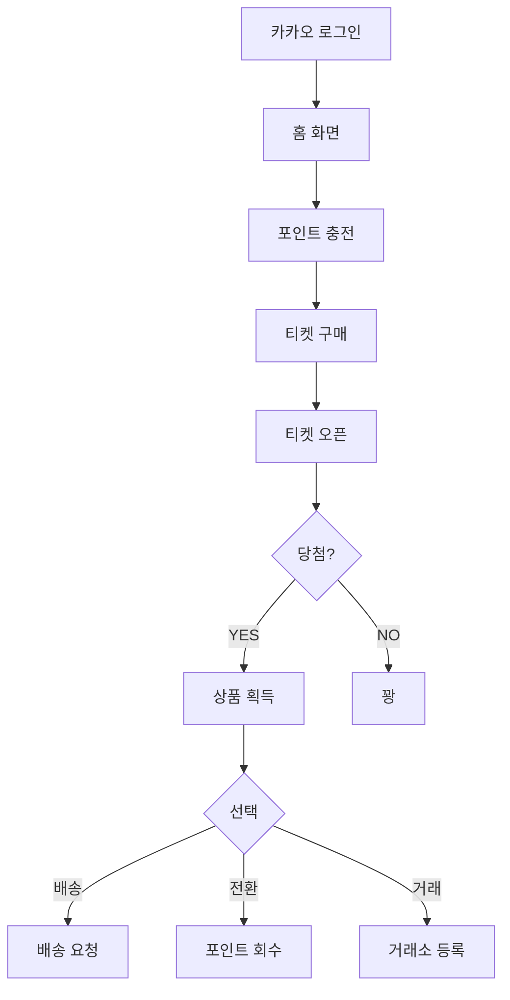

# 랜덤티켓 프로젝트 전체 문서 📚

## 목차
1. [프로젝트 개요](#프로젝트-개요)
2. [시스템 아키텍처](#시스템-아키텍처)
3. [기술 스택](#기술-스택)
4. [폴더 구조](#폴더-구조)
5. [주요 기능](#주요-기능)
6. [데이터베이스 스키마](#데이터베이스-스키마)
7. [API 명세](#api-명세)
8. [환경 설정](#환경-설정)
9. [개발 가이드](#개발-가이드)
10. [배포 가이드](#배포-가이드)

---

## 프로젝트 개요

### 서비스 설명
**랜덤티켓**은 포인트로 티켓을 구매하고 랜덤으로 상품을 받는 럭키드로우 플랫폼입니다.

### 핵심 비즈니스 로직
```
1. 사용자가 카카오로 로그인
2. 토스페이먼츠로 포인트 충전
3. 포인트로 티켓 구매 (7개 등급)
4. 티켓 오픈 시 랜덤 상품 당첨
5. 당첨 상품을 배송 요청 또는 포인트 전환
6. 거래소에서 티켓 거래 가능
7. 럭키드로우 이벤트 참여 가능
```

### 티켓 등급 시스템
```
1. 💎 다이아 티켓 - 49,000P
2. 🏆 플래티넘 티켓 - 99,000P
3. 💛 골드 티켓 - 14,900P
4. 💎 루비 티켓 - 9,900P
5. 💍 주얼리 티켓 - 19,900P
6. 💄 뷰티 티켓 - 24,900P
7. 🥩 미트 티켓 - 39,900P
```

### 사용자 플로우


---

## 시스템 아키텍처

### 전체 구조
```
┌─────────────────────────────────────────────────────────┐
│                     사용자 (모바일)                        │
└────────────────────┬────────────────────────────────────┘
                     │
                     ↓
┌─────────────────────────────────────────────────────────┐
│              프론트엔드 (React SPA)                        │
│  - React 18.3.1                                         │
│  - Vite 6.3.5                                           │
│  - Tailwind CSS 4.1.12                                  │
│  - React Router 7.13.0                                  │
└────────┬────────────────────────┬───────────────────────┘
         │                        │
         ↓                        ↓
┌────────────────────┐  ┌────────────────────────────────┐
│   카카오 OAuth     │  │      토스페이먼츠               │
│   로그인 API       │  │      결제 API                  │
└────────────────────┘  └────────────────────────────────┘
         │
         ↓
┌─────────────────────────────────────────────────────────┐
│          백엔드 (Supabase Edge Functions)                │
│  - Deno Runtime                                         │
│  - Hono Web Framework                                   │
│  - RESTful API                                          │
└────────┬────────────────────────────────────────────────┘
         │
         ↓
┌─────────────────────────────────────────────────────────┐
│          데이터베이스 (Supabase PostgreSQL)               │
│  - Key-Value Store 구조                                 │
│  - JSONB 타입 활용                                       │
└─────────────────────────────────────────────────────────┘
```

### 3-Tier 아키텍처
```
┌──────────────────────────────────────────────┐
│  Presentation Layer (프론트엔드)               │
│  - React Components                          │
│  - UI/UX                                     │
│  - Routing                                   │
└──────────────┬───────────────────────────────┘
               │
               ↓
┌──────────────────────────────────────────────┐
│  Application Layer (백엔드 API)               │
│  - 비즈니스 로직                               │
│  - 인증/인가                                   │
│  - 외부 API 연동                               │
└──────────────┬───────────────────────────────┘
               │
               ↓
┌──────────────────────────────────────────────┐
│  Data Layer (데이터베이스)                     │
│  - 데이터 저장                                 │
│  - 트랜잭션 관리                               │
│  - 무결성 보장                                 │
└──────────────────────────────────────────────┘
```

---

## 기술 스택

### 프론트엔드
```json
{
  "코어": {
    "React": "18.3.1",
    "TypeScript": "JSX/TSX",
    "Vite": "6.3.5"
  },
  "라우팅": {
    "React Router": "7.13.0"
  },
  "스타일링": {
    "Tailwind CSS": "4.1.12",
    "Emotion": "11.14.0"
  },
  "UI 라이브러리": {
    "Radix UI": "모든 컴포넌트",
    "Material UI": "7.3.5",
    "Lucide React": "0.487.0"
  },
  "차트": {
    "Recharts": "2.15.2"
  },
  "애니메이션": {
    "Motion": "12.23.24"
  },
  "폼": {
    "React Hook Form": "7.55.0"
  },
  "결제": {
    "@tosspayments/payment-sdk": "1.9.2"
  },
  "기타": {
    "XLSX": "0.18.5",
    "Sonner": "2.0.3"
  }
}
```

### 백엔드
```json
{
  "런타임": "Deno",
  "프레임워크": "Hono",
  "데이터베이스": "Supabase PostgreSQL",
  "인증": "Supabase Auth + 카카오 OAuth",
  "저장소": "Supabase Storage (선택적)"
}
```

### 외부 서비스
```
1. 카카오 로그인
   - REST API Key 사용
   - OAuth 2.0 방식

2. 토스페이먼츠
   - Client Key / Secret Key
   - 결제 승인 API

3. Supabase
   - Project ID
   - Anon Key (공개)
   - Service Role Key (비공개)
```

---

## 폴더 구조

### 전체 구조
```
/
├── src/
│   ├── app/
│   │   ├── components/          # 재사용 가능한 컴포넌트
│   │   │   ├── ui/             # shadcn/ui 컴포넌트들
│   │   │   ├── figma/          # Figma 관련 컴포넌트
│   │   │   ├── AdminLogin.tsx
│   │   │   ├── TicketDetailTemplate.tsx
│   │   │   └── ...
│   │   ├── pages/              # 페이지 컴포넌트들
│   │   │   ├── Home.tsx
│   │   │   ├── Login.tsx
│   │   │   ├── Points.tsx
│   │   │   ├── DiamondTicketDetail.tsx
│   │   │   ├── Admin.tsx
│   │   │   └── ...
│   │   ├── context/            # React Context
│   │   │   └── AppContext.tsx  # 전역 상태 관리
│   │   ├── types/              # TypeScript 타입 정의
│   │   │   └── index.ts
│   │   ├── constants/          # 상수 정의
│   │   │   └── ticketPrices.ts
│   │   ├── utils/              # 유틸리티 함수
│   │   │   └── localStorage.ts
│   │   ├── routes.ts           # 라우팅 설정
│   │   └── App.tsx             # 메인 앱 컴포넌트
│   ├── imports/                # Figma 디자인 import 파일들
│   │   ├── Home-1-253.tsx
│   │   ├── Group*.tsx
│   │   └── svg-*.ts
│   └── styles/                 # 스타일 파일
│       ├── fonts.css           # 폰트 정의
│       ├── theme.css           # 테마 변수
│       ├── tailwind.css        # Tailwind 설정
│       └── index.css           # 글로벌 스타일
├── supabase/
│   └── functions/
│       └── server/
│           ├── index.tsx       # 메인 서버 파일
│           └── kv_store.tsx    # KV Store 유틸리티
├── utils/
│   └── supabase/
│       └── info.tsx            # Supabase 설정 정보
├── package.json                # 의존성 관리
├── vite.config.ts              # Vite 설정
├── postcss.config.mjs          # PostCSS 설정
└── README.md
```

### 주요 파일 설명

#### `/src/app/App.tsx`
```typescript
// 메인 앱 컴포넌트
// - 반응형 래퍼 (모바일/데스크톱)
// - AppProvider 전역 상태 제공
// - ErrorBoundary 에러 처리
```

#### `/src/app/context/AppContext.tsx`
```typescript
// 전역 상태 관리
// - 로그인 상태
// - 사용자 데이터 (포인트, 티켓 등)
// - 카카오 액세스 토큰
```

#### `/src/app/routes.ts`
```typescript
// React Router 설정
// - 모든 페이지 라우팅
// - Lazy loading
// - 404 페이지
```

#### `/supabase/functions/server/index.tsx`
```typescript
// 백엔드 API 서버
// - Hono 프레임워크
// - 모든 API 엔드포인트
// - 인증 미들웨어
// - 비즈니스 로직
```

---

## 주요 기능

### 1. 인증 시스템

#### 카카오 로그인
```typescript
// 프론트엔드: /src/app/pages/Login.tsx
const handleKakaoLogin = () => {
  const redirectUri = `${window.location.origin}/login/callback`;
  const kakaoAuthUrl = 
    `https://kauth.kakao.com/oauth/authorize` +
    `?client_id=${KAKAO_REST_API_KEY}` +
    `&redirect_uri=${redirectUri}` +
    `&response_type=code`;
  
  window.location.href = kakaoAuthUrl;
};

// 백엔드: /supabase/functions/server/index.tsx
app.post('/make-server-53dba95c/auth/kakao', async (c) => {
  const { code } = await c.req.json();
  
  // 1. 카카오 토큰 발급
  const tokenResponse = await fetch('https://kauth.kakao.com/oauth/token', {
    method: 'POST',
    headers: { 'Content-Type': 'application/x-www-form-urlencoded' },
    body: new URLSearchParams({
      grant_type: 'authorization_code',
      client_id: KAKAO_REST_API_KEY,
      redirect_uri: redirectUri,
      code: code,
    }),
  });
  
  // 2. 사용자 정보 조회
  const userInfoResponse = await fetch('https://kapi.kakao.com/v2/user/me', {
    headers: { Authorization: `Bearer ${accessToken}` },
  });
  
  // 3. DB에 저장 또는 업데이트
  await kv.set(`user:${kakaoId}`, userData);
  
  return c.json({ success: true, userData });
});
```

#### 관리자 인증
```typescript
// 하드코딩된 비밀번호 방식
const ADMIN_SECRET = "dleogus23@";

// X-Admin-Secret 헤더로 검증
const adminSecret = c.req.header("X-Admin-Secret");
const isValid = adminSecret === ADMIN_SECRET;
```

### 2. 포인트 충전 (토스페이먼츠)

```typescript
// 프론트엔드: /src/app/pages/Points.tsx
const handleCharge = async (amount: number) => {
  const tossPayments = await loadTossPayments(clientKey);
  
  await tossPayments.requestPayment('카드', {
    amount: amount,
    orderId: generateOrderId(),
    orderName: `${amount}P 충전`,
    successUrl: `${window.location.origin}/payment/success`,
    failUrl: `${window.location.origin}/payment/fail`,
  });
};

// 백엔드: 결제 승인 API
app.post('/make-server-53dba95c/payments/confirm', async (c) => {
  const { paymentKey, orderId, amount } = await c.req.json();
  
  // 1. 토스 결제 승인 요청
  const response = await fetch(
    'https://api.tosspayments.com/v1/payments/confirm',
    {
      method: 'POST',
      headers: {
        Authorization: `Basic ${encodedSecretKey}`,
        'Content-Type': 'application/json',
      },
      body: JSON.stringify({ paymentKey, orderId, amount }),
    }
  );
  
  // 2. 포인트 지급
  const user = await kv.get(`user:${kakaoId}`);
  user.points += amount;
  await kv.set(`user:${kakaoId}`, user);
  
  // 3. 거래 내역 저장
  await kv.set(`transaction:${txId}`, transactionData);
  
  return c.json({ success: true });
});
```

### 3. 티켓 뽑기 시스템

```typescript
// 백엔드: 티켓 구매 API
app.post('/make-server-53dba95c/tickets/purchase', async (c) => {
  const { ticketType } = await c.req.json();
  const kakaoId = c.get('kakaoId'); // 인증 미들웨어에서 설정
  
  // 1. 포인트 차감
  const user = await kv.get(`user:${kakaoId}`);
  const price = TICKET_PRICES[ticketType];
  
  if (user.points < price) {
    return c.json({ error: 'Insufficient points' }, 400);
  }
  
  user.points -= price;
  await kv.set(`user:${kakaoId}`, user);
  
  // 2. 랜덤 상품 추첨
  const products = await getProductsByTicketType(ticketType);
  const wonProduct = randomDraw(products); // 확률 기반 추첨
  
  // 3. 티켓 생성
  const ticket = {
    id: generateId(),
    kakaoId,
    ticketType,
    product: wonProduct || null,
    status: wonProduct ? 'active' : 'used',
    createdAt: new Date().toISOString(),
  };
  
  await kv.set(`ticket:${ticket.id}`, ticket);
  
  return c.json({ success: true, ticket });
});
```

### 4. 관리자 대시보드

```typescript
// 탭 기반 관리 시스템
const tabs = [
  { id: 'home-products', label: '홈 메인 상품' },
  { id: 'products', label: '상품 관리' },
  { id: 'users', label: '회원 관리' },
  { id: 'lucky-draw', label: '럭키드로우' },
  { id: 'shipping', label: '배송 관리' },
  { id: 'stats', label: '통계' },
];

// 각 탭별 컴포넌트
<HomeProductsTab />  // 홈 화면 상품 선택
<ProductsTab />      // 상품 CRUD
<UsersTab />         // 회원 목록/수정
<LuckyDrawTab />     // 럭키드로우 관리
<ShippingTab />      // 배송 요청 처리
<StatsTab />         // 통계 조회
```

---

## 데이터베이스 스키마

### Key-Value Store 구조
```
테이블: kv_store_53dba95c
┌──────────────────┬──────────┬─────────────┬─────────────┐
│ key (PK)         │ value    │ created_at  │ updated_at  │
│ TEXT             │ JSONB    │ TIMESTAMP   │ TIMESTAMP   │
└──────────────────┴──────────┴─────────────┴─────────────┘
```

### 데이터 타입별 스키마

#### 1. 사용자 (user:{kakaoId})
```typescript
interface User {
  kakaoId: string;
  email: string;
  userName: string;
  profileImage?: string;
  points: number;
  createdAt: string;
  lastLoginAt: string;
  
  // 거래 내역
  transactions: Transaction[];
  
  // 당첨 티켓
  winningTickets: Ticket[];
}
```

#### 2. 상품 (product:{id})
```typescript
interface Product {
  id: string;
  name: string;
  brand: string;
  category: string;
  imageUrl: string;
  points: number;
  ticketType: 'diamond' | 'gold' | 'platinum' | 'ruby' | 'jewelry' | 'beauty' | 'meat';
  probability: number;  // 당첨 확률 (0~100)
  stock: number;        // 재고
  isActive: boolean;
  isHomeMain: boolean;  // 홈 메인 노출 여부
  createdAt: string;
}
```

#### 3. 티켓 (ticket:{id})
```typescript
interface Ticket {
  id: string;
  kakaoId: string;
  ticketType: string;
  product: Product | null;  // 당첨 상품 (없으면 꽝)
  status: 'active' | 'converted' | 'shipped' | 'delivered' | 'exchanged';
  wonAt: string;
  convertedAt?: string;
  shippedAt?: string;
}
```

#### 4. 거래 내역 (transaction:{id})
```typescript
interface Transaction {
  id: string;
  kakaoId: string;
  type: 'charge' | 'ticket_purchase' | 'ticket_convert' | 'exchange_sell' | 'exchange_buy' | 'lucky_draw';
  amount: number;  // 포인트 증감
  description: string;
  metadata?: any;
  createdAt: string;
}
```

#### 5. 배송 요청 (shipping:{id})
```typescript
interface ShippingRequest {
  id: string;
  kakaoId: string;
  ticketId: string;
  product: Product;
  recipientName: string;
  phone: string;
  address: string;
  addressDetail: string;
  zipCode: string;
  memo?: string;
  status: 'pending' | 'processing' | 'shipped' | 'delivered';
  trackingNumber?: string;
  createdAt: string;
  shippedAt?: string;
  deliveredAt?: string;
}
```

#### 6. 거래소 (exchange:{id})
```typescript
interface ExchangeListing {
  id: string;
  sellerId: string;
  ticketId: string;
  product: Product;
  price: number;
  status: 'active' | 'sold' | 'cancelled';
  createdAt: string;
  soldAt?: string;
  buyerId?: string;
}
```

#### 7. 럭키드로우 (lucky_draw:{id})
```typescript
interface LuckyDraw {
  id: string;
  title: string;
  description: string;
  imageUrl: string;
  entryPoints: number;  // 참여 비용
  prizes: Prize[];
  startDate: string;
  endDate: string;
  maxEntries: number;
  currentEntries: number;
  status: 'upcoming' | 'active' | 'ended' | 'drawn';
  participants: Participant[];
  winners?: Winner[];
}

interface Prize {
  rank: number;
  name: string;
  imageUrl: string;
  quantity: number;
}

interface Participant {
  kakaoId: string;
  userName: string;
  entries: number;  // 참여 횟수
  enteredAt: string;
}
```

---

## API 명세

### 인증 API

#### POST `/make-server-53dba95c/auth/kakao`
카카오 로그인 처리
```typescript
Request:
{
  code: string;           // 카카오 인가 코드
  redirectUri: string;    // 리다이렉트 URI
}

Response:
{
  success: true,
  userData: User,
  accessToken: string     // 카카오 액세스 토큰
}
```

#### POST `/make-server-53dba95c/auth/logout`
카카오 로그아웃
```typescript
Headers:
{
  Authorization: "Bearer {kakao_access_token}"
}

Response:
{
  success: true
}
```

### 상품 API

#### GET `/make-server-53dba95c/products`
상품 목록 조회
```typescript
Query:
?ticketType=diamond (선택)

Response:
{
  products: Product[]
}
```

#### GET `/make-server-53dba95c/home-products`
홈 메인 상품 조회
```typescript
Response:
{
  products: Product[]  // isHomeMain=true인 상품들
}
```

#### POST `/make-server-53dba95c/admin/products`
상품 생성 (관리자)
```typescript
Headers:
{
  X-Admin-Secret: "dleogus23@"
}

Request:
{
  name: string;
  brand: string;
  category: string;
  imageUrl: string;
  points: number;
  ticketType: string;
  probability: number;
  stock: number;
}

Response:
{
  success: true,
  product: Product
}
```

#### PUT `/make-server-53dba95c/admin/products/:id`
상품 수정 (관리자)

#### DELETE `/make-server-53dba95c/admin/products/:id`
상품 삭제 (관리자)

### 티켓 API

#### POST `/make-server-53dba95c/tickets/purchase`
티켓 구매
```typescript
Headers:
{
  Authorization: "Bearer {kakao_access_token}"
}

Request:
{
  ticketType: string;
  quantity: number;  // 구매 개수
}

Response:
{
  success: true,
  tickets: Ticket[],
  remainingPoints: number
}
```

#### GET `/make-server-53dba95c/tickets/winning`
당첨 티켓 목록 조회
```typescript
Headers:
{
  Authorization: "Bearer {kakao_access_token}"
}

Response:
{
  tickets: Ticket[]  // product !== null인 티켓들
}
```

### 포인트 API

#### POST `/make-server-53dba95c/payments/confirm`
결제 승인 (토스페이먼츠)
```typescript
Request:
{
  paymentKey: string;
  orderId: string;
  amount: number;
  kakaoId: string;
}

Response:
{
  success: true,
  points: number  // 충전 후 포인트
}
```

#### POST `/make-server-53dba95c/tickets/convert`
티켓 포인트 전환
```typescript
Headers:
{
  Authorization: "Bearer {kakao_access_token}"
}

Request:
{
  ticketId: string;
}

Response:
{
  success: true,
  points: number,  // 회수된 포인트
  remainingPoints: number
}
```

### 배송 API

#### POST `/make-server-53dba95c/shipping/request`
배송 요청
```typescript
Headers:
{
  Authorization: "Bearer {kakao_access_token}"
}

Request:
{
  ticketId: string;
  recipientName: string;
  phone: string;
  address: string;
  addressDetail: string;
  zipCode: string;
  memo?: string;
}

Response:
{
  success: true,
  shippingId: string
}
```

#### GET `/make-server-53dba95c/admin/shipping`
배송 목록 조회 (관리자)

#### PUT `/make-server-53dba95c/admin/shipping/:id`
배송 상태 업데이트 (관리자)

### 거래소 API

#### GET `/make-server-53dba95c/exchange/listings`
거래소 목록 조회

#### POST `/make-server-53dba95c/exchange/sell`
티켓 판매 등록

#### POST `/make-server-53dba95c/exchange/buy`
티켓 구매

### 럭키드로우 API

#### GET `/make-server-53dba95c/lucky-draw`
럭키드로우 목록 조회

#### POST `/make-server-53dba95c/lucky-draw/enter`
럭키드로우 참여

#### POST `/make-server-53dba95c/admin/lucky-draw`
럭키드로우 생성 (관리자)

#### POST `/make-server-53dba95c/admin/lucky-draw/:id/draw`
당첨자 추첨 (관리자)

### 통계 API

#### GET `/make-server-53dba95c/admin/stats`
통계 조회 (관리자)
```typescript
Response:
{
  totalUsers: number;
  totalRevenue: number;
  totalTicketsSold: number;
  ticketsByType: Record<string, number>;
  revenueByDate: Array<{ date: string, amount: number }>;
  topProducts: Product[];
}
```

---

## 환경 설정

### 환경변수

#### 프론트엔드
```typescript
// /utils/supabase/info.tsx
export const projectId = "your-project-id";
export const publicAnonKey = "your-anon-key";
```

#### 백엔드 (Supabase Secrets)
```bash
SUPABASE_URL=https://xxx.supabase.co
SUPABASE_ANON_KEY=eyJxxx...
SUPABASE_SERVICE_ROLE_KEY=eyJxxx...
SUPABASE_DB_URL=postgresql://xxx
TOSS_SECRET_KEY=test_sk_xxx
ADMIN_SECRET=dleogus23@
```

### 카카오 개발자 설정
```
1. https://developers.kakao.com
2. 내 애플리케이션 → 앱 생성
3. 플랫폼 설정 → Web 플랫폼
   - 사이트 도메인: https://your-domain.com
4. 카카오 로그인 활성화
5. Redirect URI:
   - https://your-domain.com/login/callback
6. REST API Key 복사
```

### 토스페이먼츠 설정
```
1. https://developers.tosspayments.com
2. 내 개발 정보
3. Client Key 복사
4. Secret Key 복사 (환경변수에 저장)
5. Success/Fail URL 설정
```

---

## 개발 가이드

### 로컬 개발 환경 설정

#### 1. 프로젝트 클론
```bash
# 현재는 Figma Make 환경이므로 생략
```

#### 2. 의존성 설치
```bash
npm install
# 또는
pnpm install
```

#### 3. 개발 서버 실행
```bash
npm run dev
# http://localhost:5173
```

#### 4. 빌드
```bash
npm run build
# dist/ 폴더 생성
```

### 새로운 티켓 타입 추가

#### 1. 상수 정의
```typescript
// /src/app/constants/ticketPrices.ts
export const TICKET_PRICES = {
  // ... 기존 티켓들
  emerald: 29900,  // 새로운 티켓
};
```

#### 2. 타입 정의
```typescript
// /src/app/types/index.ts
export type TicketType = 
  | 'diamond'
  // ... 기존 타입들
  | 'emerald';  // 추가
```

#### 3. 티켓 상세 페이지 생성
```typescript
// /src/app/pages/EmeraldTicketDetail.tsx
import { TicketDetailTemplate } from '../components/TicketDetailTemplate';

export default function EmeraldTicketDetail() {
  return <TicketDetailTemplate ticketType="emerald" />;
}
```

#### 4. 라우팅 추가
```typescript
// /src/app/routes.ts
{
  path: '/ticket/emerald',
  Component: lazy(() => import('./pages/EmeraldTicketDetail')),
},
```

### 새로운 API 추가

#### 1. 백엔드에 엔드포인트 추가
```typescript
// /supabase/functions/server/index.tsx
app.post('/make-server-53dba95c/new-feature', async (c) => {
  // 비즈니스 로직
  return c.json({ success: true });
});
```

#### 2. 프론트엔드에서 호출
```typescript
const response = await fetch(
  `https://${projectId}.supabase.co/functions/v1/make-server-53dba95c/new-feature`,
  {
    method: 'POST',
    headers: {
      'Authorization': `Bearer ${publicAnonKey}`,
      'Content-Type': 'application/json',
    },
    body: JSON.stringify({ data }),
  }
);
```

---

## 배포 가이드

### Figma Make 환경 (현재)
```
자동 배포됨
변경 사항은 즉시 반영
```

### 카페24로 이전 (참고: CAFE24_MIGRATION_GUIDE.md)
```
1. npm run build
2. dist/ 폴더를 FTP로 업로드
3. .htaccess 설정
4. 환경변수 수정
5. 외부 API 설정
```

### Vercel 배포
```bash
# 1. Vercel CLI 설치
npm i -g vercel

# 2. 로그인
vercel login

# 3. 배포
vercel

# 4. 프로덕션 배포
vercel --prod
```

---

## 보안 고려사항

### 1. API 키 관리
```
✅ Public 키 (공개 가능):
   - Supabase Anon Key
   - 카카오 REST API Key
   - 토스 Client Key

❌ Secret 키 (절대 노출 금지):
   - Supabase Service Role Key
   - 토스 Secret Key
   - 관리자 비밀번호
```

### 2. 인증/인가
```typescript
// 모든 사용자 API는 카카오 토큰 검증
const accessToken = c.req.header('Authorization')?.split(' ')[1];
const userInfo = await verifyKakaoToken(accessToken);

// 관리자 API는 추가로 시크릿 검증
const adminSecret = c.req.header('X-Admin-Secret');
if (adminSecret !== ADMIN_SECRET) {
  return c.json({ error: 'Unauthorized' }, 401);
}
```

### 3. CORS 설정
```typescript
// Supabase 대시보드에서 허용 도메인 설정
// 또는 백엔드에서:
app.use('*', cors({
  origin: ['https://your-domain.com'],
  credentials: true,
}));
```

---

## 트러블슈팅

### 문제 1: 카카오 로그인 실패
```
원인: Redirect URI 불일치

해결:
1. 카카오 개발자 콘솔 확인
2. Redirect URI가 정확히 일치하는지 확인
3. http/https 프로토콜 확인
```

### 문제 2: 포인트 충전 실패
```
원인: 토스 Secret Key 오류

해결:
1. Supabase Secrets에 TOSS_SECRET_KEY 확인
2. 키 형식이 올바른지 확인 (test_sk_xxx 또는 live_sk_xxx)
3. 환경(테스트/운영) 확인
```

### 문제 3: 이미지 로딩 실패
```
원인: figma:asset 경로 문제

해결:
1. Vite 빌드 설정 확인
2. 이미지 파일이 dist/assets/에 복사되었는지 확인
3. 필요시 절대 경로로 변경
```

### 문제 4: 관리자 페이지 접근 실패
```
원인: X-Admin-Secret 헤더 누락

해결:
1. 로그인 시 시크릿 입력
2. LocalStorage에 저장된 시크릿 확인
3. 서버 로그에서 헤더 전송 확인
```

---

## 성능 최적화

### 1. 코드 스플리팅
```typescript
// 이미 적용됨: React.lazy()
const Home = lazy(() => import('./pages/Home'));
```

### 2. 이미지 최적화
```
- WebP 포맷 사용
- 적절한 크기로 리사이징
- Lazy loading 적용
```

### 3. API 캐싱
```typescript
// React Query 또는 SWR 사용 권장
import useSWR from 'swr';

const { data } = useSWR('/api/products', fetcher, {
  revalidateOnFocus: false,
  revalidateOnReconnect: false,
});
```

---

## 유지보수 가이드

### 정기 점검 항목
```
□ 카카오 토큰 만료 체크
□ 토스 결제 정상 작동 확인
□ Supabase 용량 체크
□ 에러 로그 모니터링
□ 사용자 피드백 확인
□ 보안 업데이트 적용
```

### 백업 전략
```
일일 백업:
- Supabase 자동 백업 활성화
- 코드: Git repository
- 이미지: 별도 저장소

주간 백업:
- 데이터베이스 Export
- 환경변수 문서화
```

---

**작성일:** 2026-03-16  
**버전:** 1.0  
**작성자:** Figma Make AI Assistant  
**프로젝트:** 랜덤티켓 (Random Ticket)
